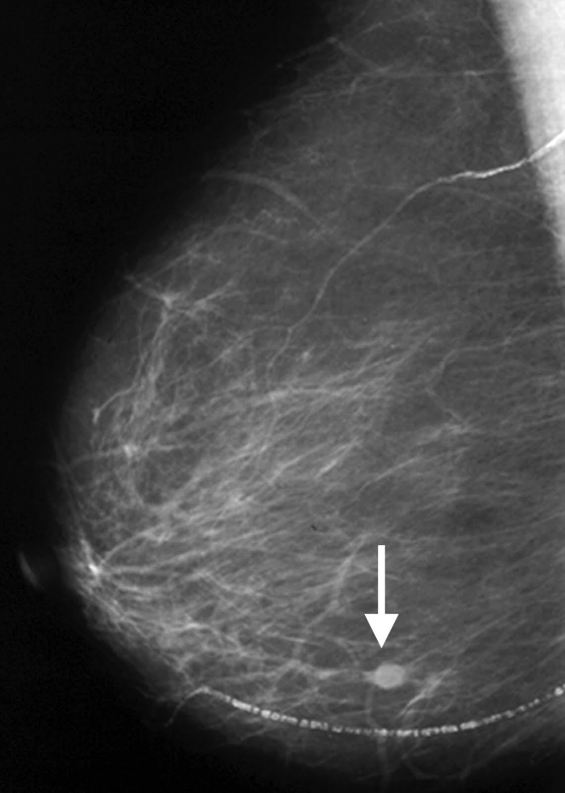
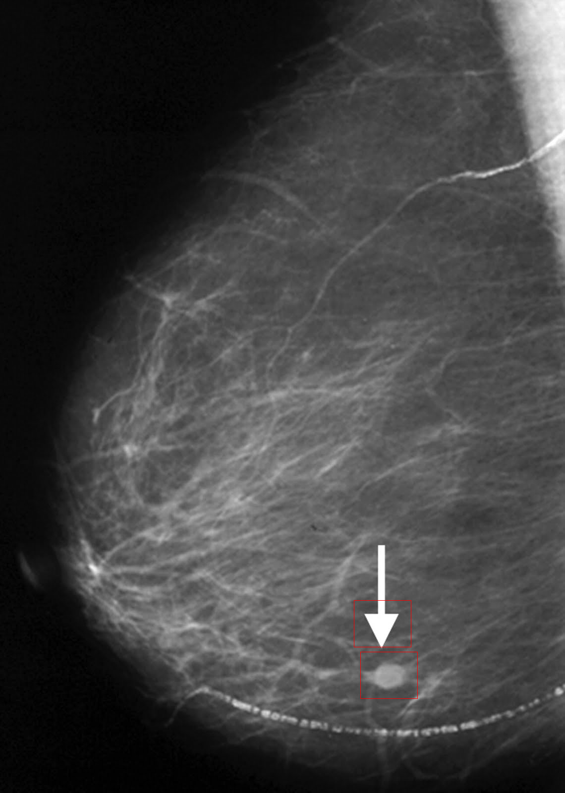
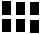

# A High Performing Image Searching Program
Image search programming with mask images

## Overview
* The image search program must be designed to handle searching for matches using an image “mask”. An image mask is a black-and-white image that essentially represents a pattern to search for

* Once a region of the image has been matched, it must not be included as part of any other matches. For each matched region, draw a red box around the region.

* Design, implement, and validate suitable parallelization approach for this problem using OpenMP.

## Environment
On the Ohio Supercomputing Center Pfizer cluster
| Component  | Details |
| ------------- | ------------- |
| CPU Model  | Intel(R) Xeon(R) Gold 6148 CPU @ 2.40GHz |
| CPU/Core Speed  | 2.40GHz   |
| RAM  | 200GB   |
| Operating system used | Linux 3.10.0-1160.95.1.el7.x86_64 #1 SMP x86_64 x86_64 x86_64 GNU/Linux    |
|Name and version of C++ compiler | gcc version 8.4.0 (GCC )  |
| Name and version of other non-standard software tools & components | OpenMP| 

## Result 1
Large Image             |  Mask                          | Detected Result             |
:-------------------------:|:-------------------------: | :-------------------------: |
  |   |  |

Performance Statistics
| #Threads |	User Time (s) | 	Elapsed Time (s) |	%CPU |
| -------- | -------------- |  -------------- |  -------------- |
| 1	 | 67.54 |	67.73 |	99%  |
| 4	 | 65.54 |	17.46	| 375% |
| 8	 | 68.92	 | 09.30	| 740% |

## Result 2
Large Image             |  Mask                          | Detected Result             |
:-------------------------:|:-------------------------: | :-------------------------: |
  |   |  |

Performance Statistics
| #Threads |	User Time (s) | 	Elapsed Time (s) |	%CPU |
| -------- | -------------- |  -------------- |  -------------- |
| 1	 | 48.54 |	48.85 |	99%  |
| 4	 | 50.41 |	15.97	| 315% |
| 8	 | 51.21	 | 10.10	| 507% |

